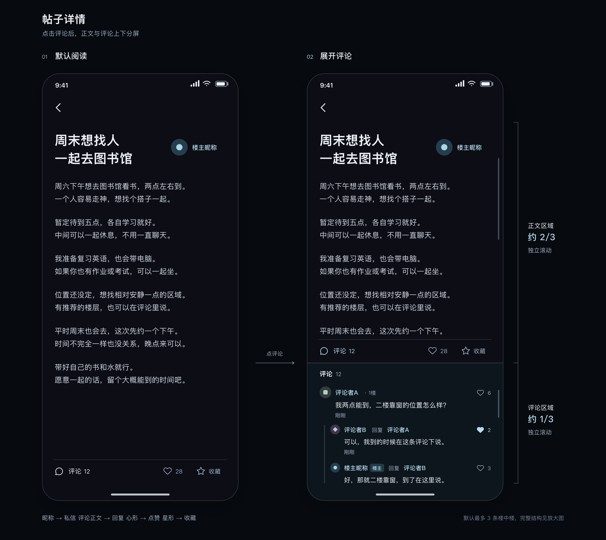

# 帖子详情、回复与面具联系交互设计

> 2026-09-09 整理说明：本文件保留为历史讨论快照，以下“当前”“下一步”等表述反映归档时的讨论，不再在此维护现行规则。最新设计见[帖子详情](../design/modules/post-detail.md)、[评论](../design/modules/comments.md)、[身份](../design/modules/identity.md)、[私信](../design/modules/messaging.md)。后续按模块更新，并可每轮并行讨论多个模块。

- 日期：2026-09-08
- 状态：第一屏深色 v2 已定稿并纳入正式设计图；后续草图按用户要求优先 PNG 交付，关系模型与异常流程仍在讨论
- 依据：本轮用户明确确认或修改，以及[主需求记录](2026-09-06-hainanu-treehole.md)
- 范围：首版手机 App 的帖子详情及关联流程；不是完整实施规格，不表示所有草图细节已经获批
- 讨论方式：按用户要求逐屏查看，第一屏已按深色 v2 定稿；后续聊天和私信列表另行讨论

## 1. 本轮已确认的产品与基础流程

| 主题 | 已确认决定 |
| --- | --- |
| 核心场景 | 吐槽、互助、找搭子、发表想法、分享生活，核心体验为“想说就说” |
| 图片 | 帖子、评论和回复均支持图片；限制与图片交互另定 |
| 昵称 | 输入框旁放随机昵称按钮，主动点击才生成，可再次生成或手动修改；不默认替用户取名 |
| 头像 | 按帖子选择，可以为不同帖子使用不同头像，也可以主动使用设置中的头像；同帖同一身份的展示保持一致 |
| 昵称唯一性 | 同一帖子不同用户不能重名，同帖后续发言沿用原昵称；不同帖子可以重名 |
| 回访入口 | 导航树固定提供消息和“我的”；“我的”包含本人帖子、回复、收藏和偏好 |
| 回复提醒 | 打开对应帖子并定位具体回复，返回消息列表 |
| 搜索 | 文字搜索帖子，按通道分组，返回保留搜索词和浏览位置；当前规则见导航模块 |
| 标签屏蔽 | 列表和搜索过滤；主动筛选不绕过屏蔽；从消息、收藏、分享直接打开时提示屏蔽且不展示正文；无临时查看 |
| 分享、关注、私信 | 最终决定保留，替代此前取消分享及暂缓关注、私信的决定；分享仍受登录限制 |
| 私密性 | 即使互关也不能查看对方历史帖子或回复，在其他帖子中不能通过平台识别为同一个人 |

## 2. 第一屏：帖子详情的点击规则

### DETAIL-02：先阅读帖子，点击评论后上下分屏

用户最新要求替代旧草图中“正文下直接铺开评论”和大尺寸回复区的布局。

**状态 A：默认阅读**

- 从通道帖子卡片进入详情，主要展示标题与正文；正文可包含已确认支持的图片。
- 展示帖子点赞数量，提供点赞与收藏操作；收藏使用五角星 star 图标。
- 左下角显示紧凑的“评论＋数量”入口，评论列表初始收起。
- 不使用先前大尺寸“回复／评论”按钮或评论输入区域占据默认阅读画面。
- 用户进一步确认：楼主头像与昵称放在标题右侧。标题位于左侧，作者身份区位于右侧；发布时间和细标签是否保留仍待确定。

**状态 B：展开评论**

- 点击左下角评论入口，底部弹出评论区域，页面分为上、下两个可操作区域。
- 下部评论区约占页面可用内容区域的三分之一；上部约三分之二继续显示帖子正文。
- 这是正文视口与评论视口并存的上下分屏；不以遮罩覆盖或禁止操作正文区。
- 上部只滚动帖子内容，下部只滚动评论；在任一区域滑动都不带动另一区域滚动。
- 评论区内继续支持点击正文回复、楼中楼明确回复对象、每楼右侧点赞和数量，以及点击他人昵称直接私信。
- 保持标题正文为阅读主内容，评论入口和面板文字的尺寸保持紧凑。

**后续需要明确的状态**

- 评论区如何收起，是否可以拖动改变高度，以及约三分之一比例在不同屏幕上的计算边界。
- 回复键盘弹出后采用 DETAIL-03 的近全屏输入方向；具体高度、目标内容过长的展示与退出行为仍待细化。
- 打开、关闭评论面板时怎样保留正文和评论各自的滚动位置；从回复输入收起键盘返回分屏时，恢复两区原浏览位置已按 DETAIL-03 确认。
- 评论为空、加载失败、长楼中楼和评论图片的展示。
- 左下角入口的数量统计主评论还是包括楼中楼。面板展开时操作栏位于正文与评论之间，基准位置已随本次定稿确认；屏幕适配另定。

### DETAIL-03：键盘弹出后的回复输入状态（2026-09-09）

用户确认的大致布局：键盘弹出后，整个屏幕主要用于当前回复；上方显示要回复的那条评论，下方为输入内容的区域与键盘。

- 回复输入时切换为以目标评论和输入为主的近全屏状态，不沿用阅读状态下正文与评论的三分之二／三分之一比例。
- 上方显示用户实际点中的主评论或楼中楼回复，继续明确其发言者与回复对象，不错置为其他评论。
- 下方展示当前输入内容与键盘；v3 图示的高度、间距和发送按钮位置已获用户确认，实际系统键盘的适配另定。
- 用户指出输入内容区域需要更明显的区分度；v2 草图增加独立底色、细边框及内边距，发送按钮置于框内，这些元素已随 v3 布局获用户确认。
- 用户要求输入画面提供添加图片功能，参考其提供的抖音截图中的入口位置，同时保留自己的视觉设计。v3 草图在框内底部放左侧图片入口、右侧发送，文字下方展示可移除的图片缩略图；该图布局已获用户确认，图片数量与上传规则未定。
- 直接评论帖子时，上方固定显示帖子标题，标题下方为高度受限的正文阅读窗口；用户确认窗口内可以上下滚动查看全文，“片段”只指同时可见的内容，不截断正文。下方保持输入框与键盘，方便边写边回看上下文。
- 用户已确认：主动收起尚未发布的输入状态后，回到之前的帖子与评论分屏，恢复正文和评论各自原来的浏览位置；未发送内容自动保留，继续回复时可以接着写。发布成功后的评论定位另按 DETAIL-04。
- 尚未确定：目标评论过长或带图时怎样展示、切换回复目标时的草稿管理、跨页面或重新启动后的草稿保留范围，以及其他未展示状态。
- 已定稿的默认阅读与展开评论两种画面继续作为浏览状态的基准；本节的[回复输入 v3 布局](2026-09-09-reply-input-preview.md)已获用户确认，作为后续身份选择界面的设计基线。

### DETAIL-04：评论发布后的浏览与反馈（2026-09-09）

用户最新明确：点击发布就直接退出评论输入界面，等待发布成功后评论自行显示，失败才反馈给用户。此决定替代此前“等发布成功再收起输入界面”的时机。

- 本帖身份已确认后，用户点击评论或回复的发布入口，立即收起输入界面与键盘，回到正文约三分之二、评论约三分之一的分屏，正文保持原阅读位置。
- 发送在后台继续，用户可以继续浏览；不留在输入界面等待，也不显示“发布中…”按钮文案。
- 发布成功后，才将真实发布的新评论显示在评论区；不提前显示为已发布评论。已确认的新评论定位与短暂高亮规则保留。
- 如果新回复位于折叠的楼中楼里，仍按已确认规则显示“已发布 · 查看”，用户点击后才展开并定位，保留默认最多三条及手动展开规则。
- 发布失败时再向用户反馈；保留本次文字、图片、回复对象与已确认身份，供恢复和再次发送。失败提示的具体形式、位置与恢复入口另行细化。
- 初次选择身份的流程保持：身份弹框里的“确认”只保存身份并回到评论输入界面；用户再次点击发布时，才执行上述立即退出与后台发送。
- 此前让用户等待、超时后再选择收起输入界面的候选方案不采用。当前确定的是发布后立即退出、成功显示内容、失败反馈；具体画面及跨页面、重新启动后的发送与草稿恢复范围仍待细化。

### IDENTITY-02：首次发送时选择帖内身份（2026-09-09）

- 用户已确认选择时机：先写评论或回复内容；在本帖尚未确认身份时，第一次点击发布入口，再选择本帖身份。
- 身份选择采用居中弹框：先收起键盘，压暗背景，在弹框内选择头像和昵称；原回复对象与待发送内容保留在背景页面。
- 头像区域可以点击更换，也提供“使用设置头像”入口，由用户主动选择。
- 昵称输入框旁提供“随机昵称”按钮；昵称由用户填写或主动随机，进入时不默认生成。
- 弹框用简短说明提示：本帖后续发言会沿用这个身份。
- 用户最新要求：去掉顶部“返回编辑”，底部改为左侧“取消”、右侧“确认”。
- “取消”关闭弹框，回到原评论或回复输入界面，保留文字、图片及回复对象；不确认本次身份选择，也不发布评论。
- “确认”仅保存本帖身份，并关闭弹框回到原评论或回复输入界面，保留文字、图片及回复对象。用户仍需再次点击该界面的发布入口，评论才会发送。
- 身份确认与评论发布是两个步骤：确认身份不触发自动发布，也不自动续跑第一次点击发布的动作。已确认身份后再次点击发布时，沿用该身份，不重复弹出身份选择框。
- 同帖后续发言沿用该身份。沿用身份不额外决定同帖头像以后能否修改。
- 本次确定的是评论与回复的首次发布流程；新建帖子的发布页以及未发言就直接私信的身份选择仍另行设计。
- 已绘制[首次发送身份选择 v3](2026-09-09-first-send-identity-preview.md)。用户已确认 v3 具体画面，以及双按钮、确认后返回评论并由用户再次点击发布的流程；图中昵称为空，因此“确认”暂不可用。
- 昵称输入时的键盘布局、头像选择详情、重名/无效昵称反馈，以及发送失败后的恢复方式仍待细化。返回评论保留本次内容不等于已确定跨页面或重新启动后的附件草稿保留范围。

### 点击区域与动作

| 用户点击的区域 | 交互结果 | 需要呈现的信息 |
| --- | --- | --- |
| 左下角“评论＋数量” | 展开底部约三分之一高的评论区 | 上部正文仍可操作，两区独立滚动 |
| 帖子点赞／收藏 | 对当前帖子点赞或收藏 | 点赞数量可见；具体选中状态与取消规则待细化 |
| 标题右侧的楼主昵称 | 直接发起与该帖内身份的私信 | 沿用帖内身份；不经过公开个人主页、社交名片或资料页 |
| 主评论中他人的昵称 | 直接发起与这个帖内身份的私信 | 联系对象是被点击的昵称 |
| 主评论正文 | 回复这条主评论 | 输入区明确当前回复对象 |
| 楼中楼某条回复的正文 | 回复那条具体回复 | 保留该条回复作为目标，不误归为回复楼主或主评论作者 |
| 每楼右侧的点赞区域 | 对对应评论点赞 | 显示点赞数量，操作不同时触发回复或私信 |
| 楼中楼“展开其余回复”入口 | 默认三条之外的回复在点击后才显示 | 回复总数不超过三条时无需此入口；不是限制主评论楼层总数 |

点击区分是本次设计的必要组成部分：昵称用于私信，评论正文用于回复，点赞区域用于点赞。评论内图片的预览手势、自己昵称的点击行为，以及被回复昵称是否同时承担私信入口，需要后续明确，不能让这些点击默认触发多个操作。

### DETAIL-01：删除联系卡片与独立私信图标

- 用户否定正文下方“想和对方继续聊”的整块联系卡片。
- 曾提出把私信图标放在昵称右侧，随后用户进一步改为直接点击昵称；独立私信图标已被替代。
- 不增加社交名片、个人信息页或相关页签作为发消息前置步骤。
- 用户仍保留关注功能，但旧联系卡片移除后的关注入口位置未确定；不能据此将关注功能整体删除，也不能擅自放回大卡片。
- “无需页签”承接用户对个人名片和中间资料页的说明，不直接推断为取消消息中心所有分类导航；消息中心布局后续单独讨论。

### AVATAR-01：帖内头像与设置中的头像

- 用户头像按帖子区分，与帖内昵称共同构成该帖的展示身份。
- 参与不同帖子时，可以选择不同头像，也可以主动使用个人设置里的头像。
- 标题右侧展示楼主头像与昵称；主评论及楼中楼回复的发言者昵称前展示头像。
- 同一帖中同一个身份出现在作者区、主评论或楼中楼时，应展示一致的头像和昵称。
- 昵称继续作为直接私信入口，不增加名片页或独立私信图标；头像本身是否也可点击另行确定。
- “使用设置中的头像”记为用户可选择的复用方式，不据此默认将所有帖子自动关联或同步成同一头像。
- 尚未决定：头像素材来源、上传与具体选择控件、默认头像、同帖头像后续能否修改，以及设置头像变更是否同步既有帖内身份。
- 用户主动跨帖复用相同头像时，可能被读者通过视觉辨认；平台仍不提供账号级关联提示或历史查询，不承诺复用头像也无法被认出。

## 3. COMMENT-02：回复具体回复，发布后显示“谁回复谁”

用户原意：回复某一条回复时，其他阅读者也必须看得出这条回复是给谁的。只在输入框里标注目标不足以满足要求。

### 正常流程

1. 用户先通过左下角“评论＋数量”展开评论区，再点击评论或某条楼中楼回复的正文。
2. 输入区标明正在回复的对象；当前草案使用目标昵称与所属楼层，具体文案可继续调整。
3. 用户输入文字，可按已确认的媒体能力添加图片。
4. 发布后，在对应楼的回复列表中显示该回复，并标出“回复者昵称 回复 被回复者昵称”。
5. 同一帖内双方继续使用各自已经确认的昵称；后续回复不能换名。

### 阅读示例

以下“用户甲／乙／丙”仅代表三个帖内身份，不是产品预设昵称。

| 内容 | 发布后的作者行 | 回复目标 |
| --- | --- | --- |
| 用户甲发布主评论 | 用户甲 · 1楼 | 当前帖子 |
| 用户乙回复甲的主评论 | 用户乙 回复 用户甲 | 甲的这条主评论 |
| 用户丙回复乙的回复 | 用户丙 回复 用户乙 | 乙的那条具体回复，不是甲的主评论 |
| 用户甲接着回复丙 | 用户甲 回复 用户丙 | 丙的那条具体回复 |

同一人可以在一楼下发多条回复。因此设计与后续实现须同时保留被回复的具体内容关系和被回复者身份，不能只保存或展示一个名字后丢失具体目标。无需在本轮预先决定数据库字段或接口名称。

### COMMENT-03：楼中楼默认三条，点击后展示其余

- 每条主评论下的楼中楼回复默认最多展示三条，超出的回复初始隐藏。
- 总数为零至三条时，不出现“展开其余回复”入口。
- 超过三条时，在已展示的三条之后提供展开入口；例如共五条时，显示“展开其余 2 条回复”。
- 只有用户点击展开后，才显示第四条及后续回复；滚动评论区本身不会自动展开隐藏回复。
- 三条上限针对单楼的楼中楼回复列表，不是整个帖子的主评论数量，也不是限制可发表的回复总数。
- 下方评论面板仍约占三分之一高度；默认已显示的三条也可能需要在面板内滚动才能看全，不为硬塞内容而缩小字号或扩大面板。
- 每条已显示回复保留发言者头像、“谁回复谁”、点赞及数量。
- 尚未决定：回复排序、展开后是否能重新收起、大量回复的加载方式及新增回复的插入行为；不预设“前三条”一定为最早或最新三条。

### 已定与待定的边界

- 已定：支持针对具体回复继续回复；发布后的内容明确显示回复对象。
- 已定：主评论可展开楼中楼，楼主有标识，同帖身份固定。
- 早期草案采用：楼中楼在一个缩进容器中平铺，作者行用“昵称 A 回复 昵称 B”；输入区可看到目标昵称和楼层。回复关系要求保留，布局需要适配新的底部三分之一评论面板。
- 待定：是否显示被回复正文的短引用、是否可定位原回复、最多缩进或嵌套几层、排序和展开后的收起行为；默认三条已按 COMMENT-03 确认。
- 待定：目标内容已删除、发出前目标失效、切换回复目标时保留输入的具体提示和恢复方式。
- 草图中的关闭图标属于回复目标取消方案，行为尚需确认，不等于取消已写草稿。

## 4. LIKE-01：帖子与评论点赞、帖子收藏

- 用户已进一步确认帖子详情也提供点赞数量与收藏；评论未展开时仍可使用这些操作。
- 收藏明确使用五角星 star 图标，替代旧草图的书签形图标；不改变心形点赞的含义。
- 每一楼层右侧可点赞，并显示点赞数量。
- 正式稿采用心形图标，分别演示未点赞与已点赞状态；本屏图形与深色配色已确认。
- 本轮楼中楼预览也画出点赞入口和数量，细化时需确认其与主评论是否完全采用同一套规则。
- 点赞区域与评论正文、昵称区域分别响应，点击点赞不能顺带进入回复或私信。
- 草图里的 12、2、0 等数字均为占位数据，不代表实际用户行为。
- 尚未决定：是否允许取消点赞、重复点击规则、本人内容能否点赞、计数更新及失败反馈，以及星形收藏的选中状态和操作反馈。
- 点赞不能擅自增加可串联用户跨帖身份的点赞者列表。

## 5. CONTACT-01：保留联系，同时隔离跨帖身份

### 已确认的产品边界

- 保留关注、互关与私信，不提供通过关注关系查看对方历史发言的权限。
- 用户明确不希望在另一帖认出已关注或互关的同一个人。
- 点击他人的帖内昵称直接私信，不先展示社交名片或账号历史。
- 后续设计不能仅隐藏“已关注”标记，却在另一帖点击私信时自动打开已有会话而暴露身份关联。

### 当前用于原型验证的“面具”方向

沿用既有帖内昵称作为联系身份，私信中显示自己正在使用的昵称，来源帖帮助理解从哪里认识对方。用户认可“戴着面具聊天”的感觉，并同意先用页面验证复杂度。

当前方案建议：关注与会话围绕具体帖内身份建立；在别帖遇见同一账号时，不自动合并联系人或会话。一个真实账号可能对应多个独立联系人，这是方案的主要取舍，关系模型仍需在后续原型讨论中最终确认。

尚未确认的事项包括：尚未在该帖发言时如何选择私信身份、陌生私信是否需要接受、互关如何操作、取关或拉黑是否影响其他面具、来源帖被删或屏蔽后的展示、联系人保存期限。不能将这些未决项直接写成已经实现的规则。

## 6. 原型与版本状态

- [Figma 文件](https://www.figma.com/design/wYSmtpR5iKKG90UsxKVeMR)
- [第一屏原始 Figma 节点](https://www.figma.com/design/wYSmtpR5iKKG90UsxKVeMR?node-id=2-139)
- [第二屏原始 Figma 节点](https://www.figma.com/design/wYSmtpR5iKKG90UsxKVeMR?node-id=2-140)

Figma 工具额度耗尽时，已绘制第一屏帖内联系和第二屏聊天草案；第三屏只建立顶部框架。随后用户要求逐屏讨论。第一屏删除联系卡片、移除私信图标、点击昵称私信、评论点赞与楼中楼回复关系等修改，尚未同步 Figma。

**用户已指定下方深色 v2 为定稿，已归档到[正式设计图](../design/post-detail-dark-final.md)。白底黑字版仅作对比。最新正式稿使用 Inkscape SVG。**

本轮调用 `figma-use` 仍返回 Starter 工具调用额度已用完。用户随后明确要求改用可用工具，正式稿采用本机 Inkscape 1.4.2 与原生可编辑 SVG，详见[编辑说明](../design/editable-design.md)。Figma 未写入，旧节点仅留作历史参考。

- [默认阅读单屏](assets/2026-09-08-post-split-read-v2.png)
- [展开评论单屏](assets/2026-09-08-post-split-comments-v2.png)
- [可编辑双状态 SVG](assets/2026-09-08-post-split-comparison-v2.svg)
- [默认阅读 SVG](assets/2026-09-08-post-split-read-v2.svg)、[展开评论 SVG](assets/2026-09-08-post-split-comments-v2.svg)
- [楼中楼三条回复与展开入口局部图](assets/2026-09-08-post-split-comments-detail-v2.png)、[可编辑 SVG](assets/2026-09-08-post-split-comments-detail-v2.svg)
- [上一版双状态布局](assets/2026-09-08-post-split-comparison.png)：保留用于对比，未包含头像和三条回复折叠。
- [旧版参考](assets/2026-09-08-post-detail.webp)：仅用于追溯此前的回复对象与点赞讨论，不能恢复旧版正文下直接铺开评论的布局。

新版 v2 展示同一帖子的默认阅读与评论展开两个状态，增加帖内头像、标题右侧作者区和星形收藏。局部放大图完整展示主评论、默认三条楼中楼与“展开其余 2 条回复”；这只是内容结构放大，不表示把手机评论面板变高。默认隐藏的第四、第五条没有绘制在折叠态中。比例说明和滚动区域标注位于产品画面外，用于设计讨论；滚动条示意两个独立视口。这是静态 UI 图，不是可运行应用，尚未验证实际手势行为。

正文、昵称、时间、数字都是明确的示例或占位内容；本轮展示的第一屏布局与深色配色已定稿。软键盘、面板拖动和收起方式等未决规则不因定稿而默认获批。

用户要求作图采用 GPT-6 Astra Ultra。本轮新版 SVG UI 由指定为 `gpt-6-astra`、`ultra` 思考强度的绘图代理设计，再由本地工具渲染为 PNG。此前 Figma 草案无法指定底层模型，不将旧输出标称为使用该模型生成。

## 7. 后续设计与实现的核对场景

以下用于后续审阅，不表示已运行应用测试：

- 从帖子卡片进入时先展示标题正文，标题右侧展示楼主头像与昵称；同时有帖子点赞数量、星形收藏与左下角“评论＋数量”，不自动铺开评论列表。
- 点击评论后，正文和评论形成约三分之二与三分之一的上下区域；正文不被遮罩禁用。
- 在上部滑动只改变正文位置，在下部滑动只改变评论位置，不因滚动一边导致另一边跟随。

- 点击甲的昵称进入与甲的帖内身份的私信，没有资料页；点击甲的评论正文则进入回复。
- 点击乙对甲的回复，输入区与发布后的作者行都指向乙，不能错误显示为回复甲。
- 丙回复乙、甲再回复丙时，展开列表中可以逐条辨认各自的对象。
- 多次参与同一帖继续沿用昵称；不同用户不能在同帖重名。
- 楼主身份区、主评论与楼中楼的同一身份头像一致；不同帖子可另选头像或主动复用设置头像。
- 分别检查某楼有零、一、三、四、五条回复时：最多三条默认可见，只有超过三条才提供展开，第四条不会通过普通滚动自动显示。
- 展开后显示其余回复，正文的滚动位置不被带动。
- 点击右侧点赞只影响该条评论，数量可见，不触发回复或私信。
- 第一屏没有“继续聊”联系卡片，也没有独立私信图标。
- 已关注或互关用户在其他帖中的身份不会通过关系状态、私信跳转或公开历史被关联。
- 回复提醒和搜索返回路径、登录限制、标签屏蔽仍遵守已确认规则。

第一屏浏览状态的正式稿已归档；后续按用户要求优先交付 PNG。下一步细化 DETAIL-03 回复输入状态，用户已确认上方目标评论、下方输入内容与键盘的大致布局。关注入口、首次私信取名和异常情况尚待讨论；第二屏和私信列表暂不替用户继续定稿。
